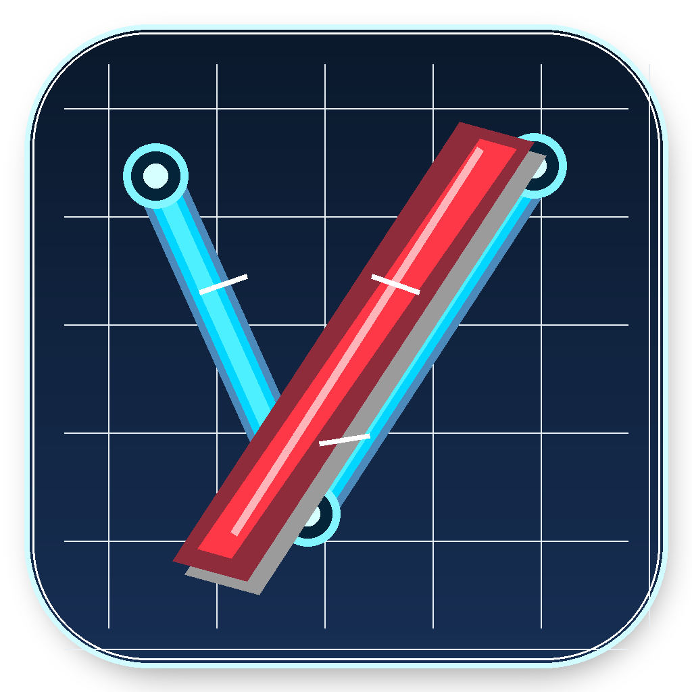

<p align="center">
  
</p>

<h1 align="center">Vektorrazor</h1>

<p align="center">
  <strong>PNG logo preparation → CAD-oriented vector contours</strong>
</p>

<p align="center">
  <a href="README.de.md">🇩🇪 Deutsch</a> ·
  <a href="README.en.md">🇬🇧 English</a>
</p>


<p align="center">


</p>

<p align="center"><strong>Copyright (C) 2026 Andreas Rottmann</strong></p>

## Schnellstart

Deutsch: [README.de.md](README.de.md)  
English: [README.en.md](README.en.md)

## Build für Windows EXE

```bat
pyinstaller --onefile --windowed --clean --name Vektorrazor --icon assets\\vektorrazor.ico --add-data "assets\\vektorrazor.ico;assets" --add-data "assets\\vektorrazor_icon.png;assets" main.py
```

Das Icon liegt unter `assets/vektorrazor.ico` und wird mit `--icon` in die EXE eingebettet.  
Für das Tkinter-Fenster wird dasselbe Icon zusätzlich per `--add-data` mitgeliefert.

## Lizenz

GPL-3.0, siehe [LICENSE](LICENSE).
